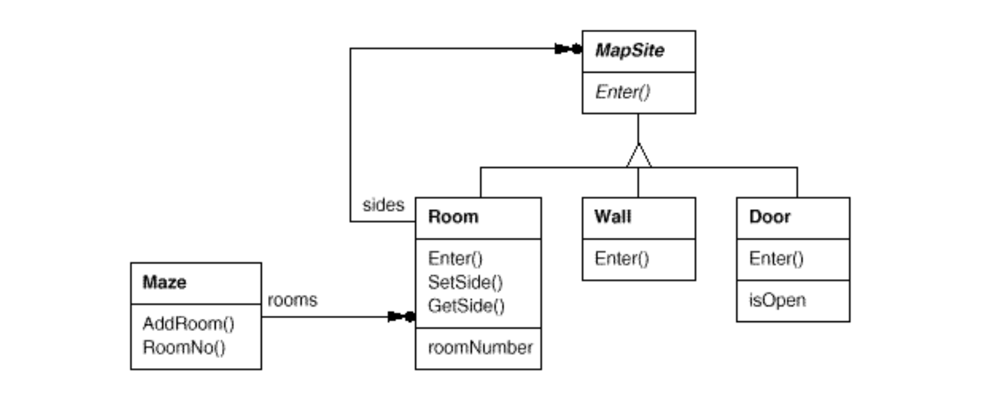

# Creational Pattern - Use Case Set-up

Lets imagine we are building a video game to solve a maze.

The game might involve:
- A player exploring rooms in the maze.
- Some rooms might have doors that lead to other rooms, while others might be blocked by walls.
- In this case, the maze is made up of objects like Room, Wall, and Door. These are the components of the maze.

- A Room knows its neighboring rooms. 
- A Door can connect two rooms, allowing the player to move between them.
- A Wall blocks the way.

