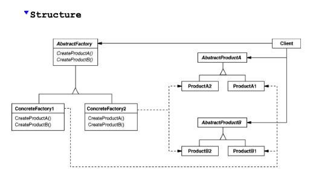
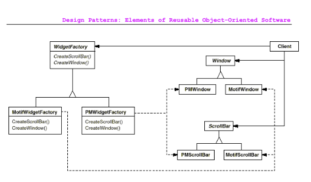

# Abstract Factory Pattern

- Note: (*Important*) `Abstract Factory` is also known as `Kit`.

### Definition:
Provide an interface for creating families of related or dependent objects without specifying their concrete classes.

### Understanding what it means?
Imagine you are building a user interface (UI) application. 
You want it to work with different **themes** (or "look-and-feel" styles) like **Motif** or **Presentation Manager**. 
Each theme defines its own version of widgets like buttons, scroll bars, and windows. 
You don’t want to hard-code any particular theme into your application, because you want to be able to switch between these themes easily.

The **Abstract Factory** pattern solves this by creating a **common interface** for producing each kind of widget (like buttons or scroll bars). 
This interface doesn't create the actual widgets—it only defines what kinds of widgets can be made. 
Then, you create **concrete factories** that produce the widgets for each specific theme (Motif, Presentation Manager, etc.).

#### What does this look like?
- There is an **abstract factory** that declares methods for creating widgets (like `createButton()`, `createScrollBar()`, etc.).
- Each **concrete factory** implements the methods and returns specific widgets for that theme (like a Motif button, or a Motif scroll bar).
- The **client** (your application) doesn't know or care about the actual widget classes;
- it only interacts with the factory through the abstract interface.

This way, your application can **switch between different themes** by simply using a different concrete factory (e.g., MotifFactory or PresentationManagerFactory), without changing any of the code that interacts with the widgets.

### When to Use Abstract Factory?

Use the **Abstract Factory** pattern when:
1. **You want the system to be independent of how objects are created**. The system shouldn’t need to know how the widgets (or any other objects) are made.
2. **You need to configure the system with one of several families of objects**. For example, in the widget example, you configure the system with either Motif widgets or PM widgets.
3. **You want to enforce consistency**. You want all the widgets in your UI to come from the same family (all Motif widgets or all PM widgets), not a mix.
4. **You want to provide a library of related products**. You can give users access to different types of widgets without showing them how the widgets are implemented.

#### **Key Participants**
- **AbstractFactory (WidgetFactory)**: Declares the operations for creating abstract product objects.
- **ConcreteFactory (MotifWidgetFactory, PMWidgetFactory)**: Implements the operations to create concrete product objects (like the specific theme widgets).
- **AbstractProduct (Button, ScrollBar)**: Declares the interface for each type of product (like buttons or scroll bars).
- **ConcreteProduct (MotifButton, PMScrollBar)**: Defines a product that a concrete factory will create. These implement the abstract product interface.
- **Client**: The application that uses the abstract factory to create product objects. The client interacts only with the factory's interface and doesn’t know about the concrete classes.

#### **Consequences of Using Abstract Factory**
1. **Isolates Concrete Classes**: Clients use the abstract factory’s interface, so they don’t depend on the concrete product classes. This **isolates** the client from specific classes, making it easier to change or update the underlying objects.
2. **Makes Exchanging Product Families Easy**: You can change the look and feel of your application by simply switching the concrete factory. For example, switching from Motif widgets to Presentation Manager widgets is easy—just use a different factory.
3. **Promotes Consistency Among Products**: If product objects in a family are designed to work together, the Abstract Factory pattern ensures that only related objects (like Motif widgets) are used together.
4. **(Important) Difficult to Support New Products**: It’s not easy to add new types of products to an existing Abstract Factory. If you want to add a new widget type (like a new kind of button), you’d have to change the abstract factory interface and all its subclasses.

#### Summary
The **Abstract Factory** pattern is all about providing a consistent way to create related objects, such as UI components, without specifying their exact classes. It allows systems to switch between different families of objects (like different themes or styles) easily while maintaining consistency. However, adding new product types can be challenging because you need to modify the factory interface and all its subclasses.
