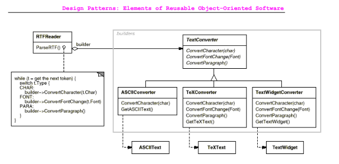
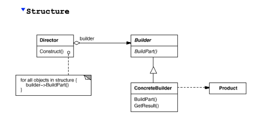
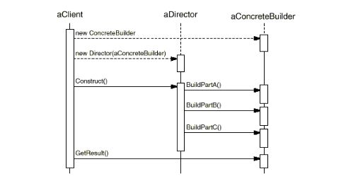

### Builder Pattern 

Definition: 
The **Builder** pattern is used to **separate the construction** of a complex object from its representation, meaning that the same process can create different representations of an object. 
This is particularly useful when you want to create various forms or outputs from the same building steps.

  
### **An Example**

Imagine a tool that reads **RTF (Rich Text Format)** documents. 
The tool might convert the RTF document into **plain text**, **TeX**, or even into a graphical interface where the user can **edit** the text.
The challenge here is that you may want to add new conversion formats without changing the reader itself.

The **Builder** pattern solves this by allowing you to define different conversion strategies without changing how the reader works. 
  You configure the **RTFReader** class with a **TextConverter** object, which handles the conversion of each piece of RTF text. 

For example:
- An **ASCIIConverter** would ignore all style elements and convert only the plain text.
- A **TeXConverter** would convert the text while preserving styles and formatting.
- A **TextWidgetConverter** would create a user interface component that allows users to edit the text.



In this way, the **RTFReader** (which is like a "director") controls the building process, 
while the **TextConverter** (the "builder") handles the creation of the specific output format. 
This lets you reuse the same parsing logic but produce different document representations.

### **When to Use the Builder Pattern**

You should use the **Builder** pattern when:
1. **The algorithm for creating a complex object** (like parsing RTF) should be independent of the parts that make up the object (like plain text, widgets, etc.).
2. **The construction process must allow for different representations** of the final object. For example, converting RTF into plain text, TeX, or a user-editable widget.




### **Key Participants**
1. **Builder (TextConverter)**:
   - Defines the interface for creating parts of a product. This is an abstract class that defines how to convert RTF tokens into different formats.

2. **ConcreteBuilder (ASCIIConverter, TeXConverter, TextWidgetConverter)**:
   - Implements the builder interface for creating specific types of products (e.g., converting to plain text, TeX, or a text widget).

3. **Director (RTFReader)**:
   - Uses the builder interface to construct the object. In this case, it controls the process of parsing an RTF document and issuing conversion requests to the builder.

4. **Product (ASCIIText, TeXText, TextWidget)**:
   - Represents the final product being built. Each **ConcreteBuilder** constructs a different product, such as plain text, TeX-formatted text, or a user-editable widget.


### **How It Works**



1. The **client** creates a **Director** (in this case, the RTFReader) and configures it with the desired **Builder** (like `ASCIIConverter` or `TeXConverter`).

2. The **Director** (RTFReader) parses the document and, whenever it finds an RTF token, asks the **Builder** to handle the conversion of that token.

3. The **Builder** creates parts of the final product step by step (e.g., converting text, adding formatting, etc.).

4. Once the parsing is done, the **client** retrieves the final product from the **Builder**.


### **Consequences of Using the Builder Pattern**
1. **Varying the Product’s Internal Representation**:
   - The **Builder** pattern allows you to **vary the internal representation** of a product. For instance, you could reuse the same RTF parsing logic to create **ASCII text**, **TeX**, or a **UI widget** without changing the parsing process.

2. **Isolating Construction and Representation**:
   - The pattern separates the logic of **how an object is built** from its final representation. The **Builder** handles the creation, while the **Director** simply follows the building steps. This modularity improves code clarity and makes it easier to add new builders in the future.

3. **Finer Control Over the Construction Process**:
   - Unlike some other creational patterns that build an object all at once, the **Builder** pattern constructs the object step by step. This gives the **Director** finer control over how the object is assembled and allows changes mid-construction.


### **Example: Builder in Action**

Let's translate the RTF example into Python to show how this works:

```python
# Abstract Builder (TextConverter)
class TextConverter:
    def convert_text(self, text):
        pass

# Concrete Builders
class ASCIIConverter(TextConverter):
    def __init__(self):
        self.result = ""

    def convert_text(self, text):
        self.result += text  # Ignore formatting and add plain text

    def get_result(self):
        return self.result

class TeXConverter(TextConverter):
    def __init__(self):
        self.result = ""

    def convert_text(self, text):
        self.result += f"\\text{{{text}}}"  # Add TeX formatting

    def get_result(self):
        return self.result

class TextWidgetConverter(TextConverter):
    def __init__(self):
        self.result = []

    def convert_text(self, text):
        self.result.append(f"[Widget: {text}]")  # Simulate a UI widget

    def get_result(self):
        return self.result

# Director (RTFReader)
class RTFReader:
    def __init__(self, builder):
        self.builder = builder

    def parse(self, text):
        for word in text.split():
            self.builder.convert_text(word)

# Client code
rtf_text = "This is a sample RTF text"

# Create an ASCII converter
ascii_builder = ASCIIConverter()
reader = RTFReader(ascii_builder)
reader.parse(rtf_text)
print(ascii_builder.get_result())  # Outputs plain ASCII text

# Create a TeX converter
tex_builder = TeXConverter()
reader = RTFReader(tex_builder)
reader.parse(rtf_text)
print(tex_builder.get_result())  # Outputs TeX-formatted text
```
