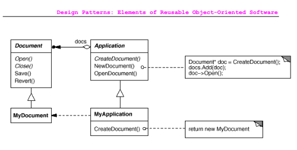
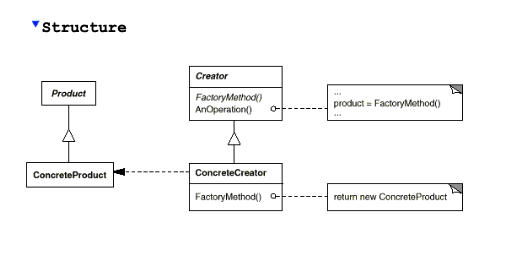
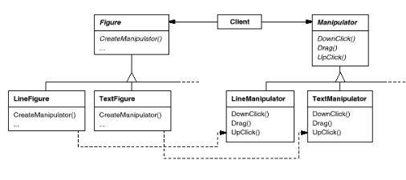

### Factory Method Pattern

The **Factory Method** pattern defines an interface for creating objects, 
but allows subclasses to decide which specific class to instantiate. 
This pattern enables a class to defer the instantiation of objects to its subclasses, making the code more flexible and extensible.


### **Motivation**
In frameworks that deal with multiple object types, 
like an application that manages different document types, we face the challenge of creating these objects without knowing their exact classes in advance. 

For instance, consider a framework with two main abstract classes:
- **Application**: Manages documents.
- **Document**: Represents the documents themselves.

When a user wants to create a new document, 
the `Application` class cannot know in advance what specific `Document` subclass (like `DrawingDocument` or `TextDocument`) to instantiate. 
This is where the Factory Method comes in: it encapsulates the knowledge of which specific `Document` subclass to create.
By defining a factory method (like `CreateDocument`), 
the `Application` class delegates the responsibility of instantiating documents to its subclasses. 
Each subclass implements the factory method to create the appropriate document type without the parent class needing to know the details.




### **When to Use the Factory Method Pattern**
You should use the **Factory Method** pattern when:
- A class cannot anticipate the type of objects it needs to create.
- You want subclasses to specify which objects to create.
- Classes delegate the responsibility of creating objects to one of several helper subclasses, and you want to keep the knowledge of which helper to use localized.


### **Structure of the Factory Method Pattern**
1. **Product**: This is the base class that defines what a product is. It sets the standard for all products created by the factory method. For example, in our case, `Document` is a product.
2. **ConcreteProduct**: This is a specific implementation of the Product. It defines what a particular product looks like and how it behaves. In our example, `MyDocument` is a `ConcreteProduct` that implements the Document interface.
3. **Creator**: This is an abstract class that declares the factory method (`create_document`). Typically, it defines how to create a product without specifying which exact class of product will be created.
4. **ConcreteCreator**: This is a subclass of `Creator` that overrides the factory method to create and return a specific type of `ConcreteProduct`. In our example, `MyApplication` is a `ConcreteCreator` that creates `MyDocument`.
   
1. The `Creator` class contains the factory method, which is a placeholder for creating products. Subclasses (like `MyApplication`) implement this method to specify exactly what product to create.
2. Clients use the `Creator` class to request products. They don’t need to know the details about which specific class of product is being created. They simply call the factory method.




### **Consequences of Using the Factory Method Pattern**
1. **Decoupling Code**: Factory methods allow you to eliminate the need to bind application-specific classes into your code. This means the code can work with any subclass of Product through the Product interface.
2. **Subclass Hooks**: Creating objects through a factory method provides a hook for subclasses to extend or customize the object creation process.
3. **Connecting Class Hierarchies**: The factory method connects two parallel class hierarchies (like figures and manipulators), allowing clients to create instances without knowing specific details about the implementations.



### **Example Implementation**
Here’s a simple example using the Factory Method pattern in Python:
```python
# Product

# Document: This is the abstract base class (Product).
# It defines a method open(), which must be implemented by any subclass. If you try to call open() on Document directly, it raises an error.
class Document:
    def open(self):
        raise NotImplementedError("Subclasses should implement this!")

# DefaultDocument: This is a ConcreteProduct that inherits from Document.
# It provides its own implementation of the open() method, which returns a message indicating that the document is being opened.
class DefaultDocument(Document):
    def __init__(self):
        self.document = "Default Document"

    def read(self):
        "logic for reading document"
        return self.document

    def open(self):
        return self.read()

# MyDocument: This is a another ConcreteProduct that inherits from Document.
# It provides its own implementation of the open() method, which returns a message indicating that the document is being opened.
# This is how it can act as a hook for custom logic; this function opens the document by converting it to a different language
class MyDocument(Document):
    def __init__(self):
        self.document = "Default Document"

    def read(self):
        "logic for reading document"
        return self.document

    def translate(self, text):
        "logic for translating document"
        return translated_text

    def open(self):
        document_content = self.read()
        return self.translate(document_content)


# Application: This is the abstract Creator class.
# It declares the factory method create_document() but doesn’t implement it.
# The open_document() method uses this factory method to create a document and then calls the open() method on that document.
class Application:
    def create_document(self):
        raise NotImplementedError("Subclasses should implement this!")

    def open_document(self):
        doc = self.create_document()
        print(doc.open())

DefaultApplication: This is the ConcreteCreator. It overrides the create_document() method to create a Default instance.
# Concrete Creator
class DefaultApplication(Application):
    def create_document(self):
        return DefaultDocument()

# Client code
app = DefaultApplication()
app.open_document()
```

This pattern promotes flexibility and makes it easier to add new product types without changing existing code.
