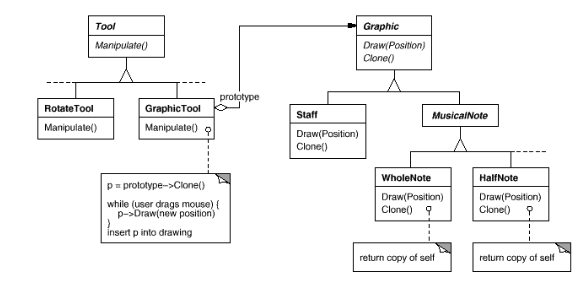
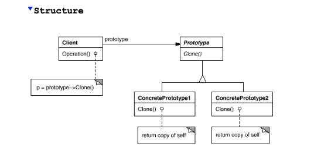

# Prototype Pattern
The **Prototype** pattern allows you to create new objects by copying existing ones, known as prototypes. 
This is useful when creating new instances of a class is complex or expensive.
This is also useful when you want to avoid creating a hierarchy of factories that mirrors your product classes.
---

### **Practical Example**
Imagine you're building a **graphic editor** for musical scores. 
This editor needs to handle various musical symbols like notes, rests, and staff lines. 
Users can interact with these symbols using tools like a note tool to add notes or a move tool to adjust their position.

The challenge is that the editor framework provides generic classes like `Graphic` for graphical elements and `Tool` for tools. 
However, the framework doesn't know about the specific musical symbols your application uses.
Creating subclasses for every possible musical symbol tool (like `QuarterNoteTool`, `HalfNoteTool`, etc.) would lead to a proliferation of classes, which is cumbersome and hard to maintain.

**Solution:** 
Use the **Prototype** pattern to create new musical symbols by cloning existing ones. 
Each tool can be configured with a prototype of the symbol it creates. When the user uses a tool, it clones its prototype to create a new symbol.
---

### **When to Use the Prototype Pattern**
- **Class Instantiation is Complex:** When creating new instances involves a lot of setup or is resource-intensive.
- **Avoiding Subclassing:** When you want to avoid creating a large number of subclasses just to specify different object types.
- **Runtime Class Specification:** When the classes to instantiate are specified at runtime, perhaps by dynamic loading.
---



### **Key Participants**
1. **Prototype Interface:** An interface that declares a `clone` method. In Python, this could be achieved by implementing the `copy` method.
2. **Concrete Prototype:** Classes that implement the prototype interface and are capable of cloning themselves.
3. **Client:** The object that uses the prototype to create new objects by cloning.


---

### **How It Works**
- **Cloning Objects:** Instead of instantiating a new object directly, the client calls the `clone` method on a prototype.
- **Configuring Prototypes:** You create one or more prototype instances, each configured with the state you want. These prototypes are then used to create new objects.
---

### **Example: Music Editor Using Prototypes**
A simplified version of the music editor using the Prototype pattern in Python.

#### **Step 1: Define the Prototype Interface**
```python
import copy

# Graphic is the base class for all graphical elements.
# The clone method uses deepcopy to create a new instance.
class Graphic:
    def clone(self):
        return copy.deepcopy(self)
```

#### **Step 2: Create Concrete Prototypes**
```python
# MusicalNote represents a musical note with specific attributes.
class MusicalNote(Graphic):
    def __init__(self, duration, pitch, symbol):
        self.duration = duration
        self.pitch = pitch
        self.symbol = symbol
        self.position = 0 # degrees

    def display(self):
        print(f"Note: {self.symbol}, Duration: {self.duration}, Pitch: {self.pitch}, Position: {self.position}")

    def rotate(self, degrees):
        self.position += degrees
```

#### **Step 3: Configure Prototypes**
```python
# Prototypes
quarter_note_prototype = MusicalNote(duration=0.25, pitch="C4", symbol="♩")
half_note_prototype = MusicalNote(duration=0.5, pitch="C4", symbol="|-")
```

#### **Step 4: Create a Tool that Uses Prototypes**
```python
# NoteTool is configured with a prototype and uses it to create new notes.
class NoteTool:
    def __init__(self, prototype):
        self.prototype = prototype

    def create_note(self):
        return self.prototype.clone()
```

#### **Step 5: Using the Tool to Create Notes**
```python
# Create tools
quarter_note_tool = NoteTool(quarter_note_prototype)
half_note_tool = NoteTool(half_note_prototype)

# Use tools to create notes
note1 = quarter_note_tool.create_note()
note2 = half_note_tool.create_note()

# Display the notes
note1.display()
note2.rotate(45) # rotate 45 degrees
note2.display()
```

#### **Step 6: Prototype Registry / Prototype Manager**
```python
# You can maintain a registry of prototypes to manage them efficiently.
class PrototypeRegistry:
    def __init__(self):
        self._prototypes = {}

    def register_prototype(self, name, prototype):
        self._prototypes[name] = prototype

    def unregister_prototype(self, name):
        del self._prototypes[name]

    def get_prototype(self, name):
        prototype = self._prototypes.get(name)
        if prototype:
            return prototype.clone()
        else:
            raise ValueError(f"Prototype '{name}' not found.")

# Create registry and register prototypes
registry = PrototypeRegistry()
registry.register_prototype("quarter_note", quarter_note_prototype)
registry.register_prototype("half_note", half_note_prototype)

# Retrieve and clone prototypes
note3 = registry.get_prototype("quarter_note")
note3.display()
```
---

### Advantages of the Prototype Pattern
- Adding New Products at Runtime: You can add new prototypes dynamically without changing existing code. For example, if you want to add an eighth note, you can create a new prototype at runtime.
- Reduced Number of Classes: Instead of creating a subclass for every possible note type, you use prototypes to represent different configurations.
- Dynamic Object Creation: Objects can be created based on dynamic conditions, and you can change prototypes on the fly.


### When Not to Use the Prototype Pattern
- Complex Object Structures: If objects have complex interdependencies or circular references, cloning can become complicated.
- Deep vs. Shallow Copy Issues: Cloning may not be straightforward if objects manage resources like file handles or network connections (objects that maintain state).
- ex: The TCPConnection object can be in several different states, such as Established, Listening, or Closed. Deep copying an object would not replicate states like connected (the connection must be established again).
--- 

## Maze Game Example
**Implementing MazePrototypeFactory in Python**

```python
import copy

class Maze:
    def __init__(self):
        self.rooms = []

    def add_room(self, room):
        self.rooms.append(room)

    def clone(self):
        return copy.deepcopy(self)

class Room:
    def __init__(self, room_number):
        self.room_number = room_number
        self.sides = [None] * 4  # [North, East, South, West]

    def set_side(self, direction, map_site):
        self.sides[direction] = map_site

    def clone(self):
        return copy.deepcopy(self)

class Wall:
    def clone(self):
        return copy.deepcopy(self)

class Door:
    def __init__(self, room1=None, room2=None):
        self.room1 = room1
        self.room2 = room2
        self.is_open = False

    def initialize(self, room1, room2):
        self.room1 = room1
        self.room2 = room2

    def clone(self):
        # Create a shallow copy and reset rooms
        new_door = copy.copy(self)
        new_door.room1 = None
        new_door.room2 = None
        return new_door
```
